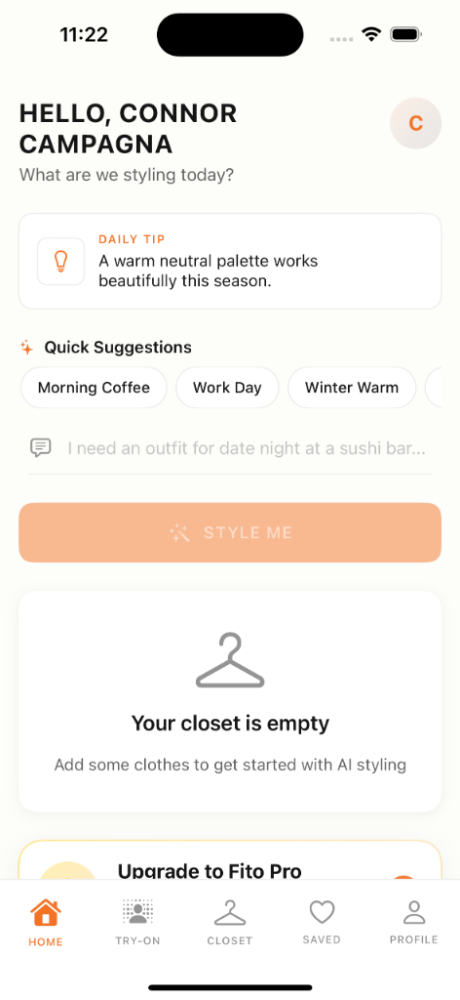
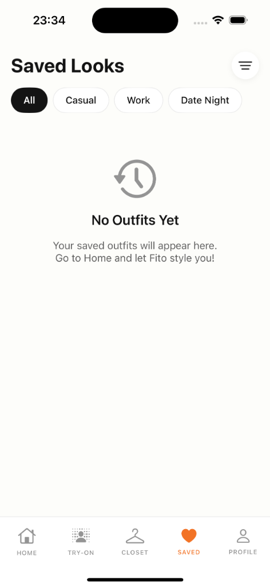

<p align="center">
  
  
  
  
</p>

<h1 align="center">👗 Fito - AI Outfit Picker</h1>

<p align="center">
  <strong>Your personal AI-powered wardrobe stylist</strong><br>
  Get outfit recommendations based on your closet, occasion, and personal style.
</p>

---

## 📱 Screenshots

<p align="center">
  
  &nbsp;&nbsp;&nbsp;&nbsp;
  
</p>

---

##  Features

###  **Smart Home Screen**
- Personalized daily styling tips
- Quick suggestion chips for common occasions
- Natural language outfit requests ("I need an outfit for date night at a sushi bar...")
- One-tap "Style Me" button for instant AI recommendations

###  **Digital Closet**
- Upload photos of your clothes
- AI-powered item categorization
- Organize by category: Tops, Bottoms, Dresses, Shoes & more
- Tag items with colors, brands, and occasions

### **Saved Looks**
- Save your favorite AI-generated outfits
- Filter by occasion: Casual, Work, Date Night
- Quick access to go-to looks
- Rate and favorite outfits

###  **AI Styling Engine**
- Powered by Google Gemini AI
- Context-aware recommendations based on:
  - Weather & season
  - Occasion & setting
  - Your personal style preferences
  - Items in your closet

---

## 🛠️ Tech Stack

| Layer | Technology |
|-------|------------|
| **iOS App** | SwiftUI, Swift 5.9, iOS 17+ |
| **Backend** | Node.js, Express, Prisma ORM |
| **Database** | PostgreSQL (Supabase) |
| **AI** | Google Gemini API |
| **Payments** | Stripe, Apple In-App Purchases |
| **Auth** | JWT with refresh tokens |
| **Deployment** | Vercel (Backend) |

---

## Getting Started

### Prerequisites
- Xcode 15+
- Node.js 18+
- iOS 17+ device or simulator

### iOS App Setup
1. Clone the repository
   ```bash
   git clone https://github.com/connorcampagna/fito.git
   cd fito
   ```

2. Open in Xcode
   ```bash
   open outfitPicker.xcodeproj
   ```

3. Build and run on your device/simulator

### Backend Setup
1. Navigate to backend
   ```bash
   cd backend
   ```

2. Install dependencies
   ```bash
   npm install
   ```

3. Create environment file
   ```bash
   cp .env.example .env
   ```

4. Add your API keys to `.env`:
   ```env
   DATABASE_URL="your_postgres_url"
   GEMINI_API_KEY="your_gemini_key"
   JWT_SECRET="your_jwt_secret"
   JWT_REFRESH_SECRET="your_refresh_secret"
   STRIPE_SECRET_KEY="your_stripe_key"
   ```

5. Run database migrations
   ```bash
   npx prisma db push
   ```

6. Start the server
   ```bash
   npm run dev
   ```

---

## 📦 Project Structure

```
fito/
├── outfitPicker/              # iOS App
│   ├── Models/                # Data models
│   ├── Views/                 # SwiftUI views
│   │   ├── Home/
│   │   ├── Closet/
│   │   ├── History/
│   │   ├── Profile/
│   │   └── Components/
│   ├── ViewModels/            # View logic
│   ├── Services/              # API & Auth services
│   └── Utilities/             # Extensions & helpers
│
├── backend/                   # Node.js API
│   ├── index.js               # Express server
│   ├── prisma/
│   │   └── schema.prisma      # Database schema
│   └── vercel.json            # Deployment config
│
└── screenshots/               # App screenshots
```

---


## 🔐 Security

- All API keys and secrets are stored in environment variables
- JWT-based authentication with token refresh
- Passwords hashed with bcrypt (12 rounds)
- Rate limiting on all endpoints
- CORS protection in production

---

## 📄 License

This project is proprietary software. All rights reserved.

---

## 👨‍💻 Author

**Connor Campagna**

---

